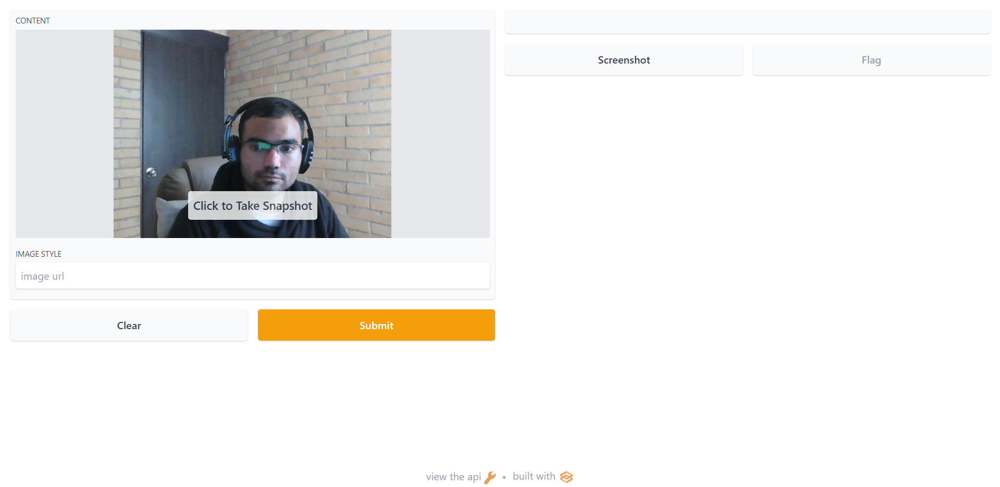

# Gradio app

## Description

This is a simle demo of gradio app, more details can be found in the following [post](https://manuel-gilm.medium.com/build-and-deploy-machine-learning-apps-with-gradio-the-easiest-way-to-create-a-web-user-interface-6f5219025da3)

## Use.

It is recomendable to use a virtualenv to test the script. Before that just run.

```python
pip install -r requirements.txt
python helloworld.py
```
## How it looks


